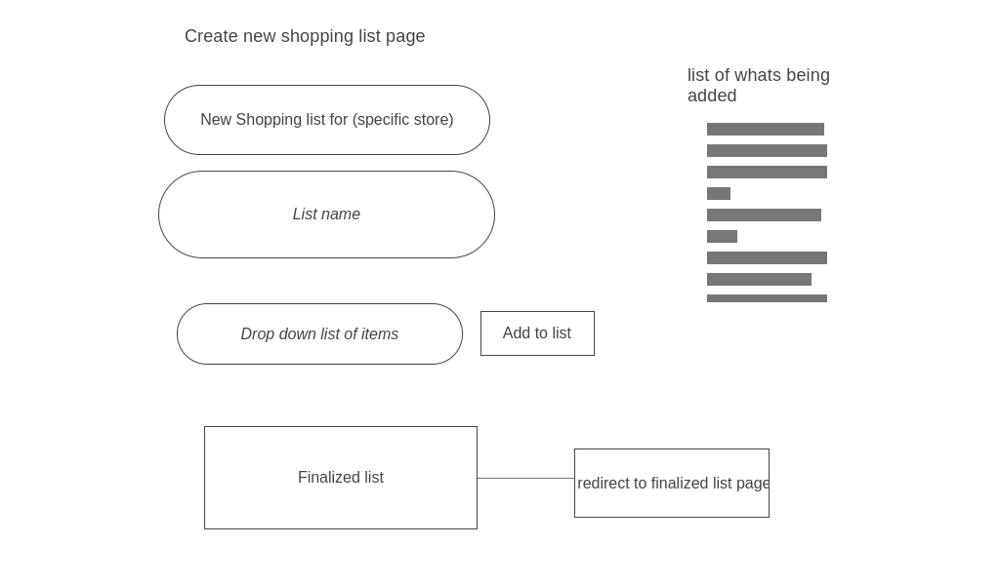

# Project-One---Shopping-List-

MVP:
    A shopping list app where users can login and add stores, products and shopping lists to their account.

Technologies:

* Front End
  * Bootstrap
  * Jquery
* Backend
  * bcrypt
  * body parser
  * express/sessions
  * mongoDB
  * mongoose

User Stories:
 - User logs in or registers
 - User can add stores
 - User can add products, selecting which store they belong to
 - From each store the user can create lists based on the products from that store
 - When creating a list, the user will be able to see the items being added to their list on the right, then "finalize" the list and add it to their collection of lists
 - User is able to create new stores and products from all pages, in addition to being able to navigate to all Lists and Stores.  
   

Sprints: 

ERD:  

Starting page: 

Register: 

Login:

Home: 

New Store:

Store Show Page:

New Shopping List:

Finalized List Page:

List Show Page:

